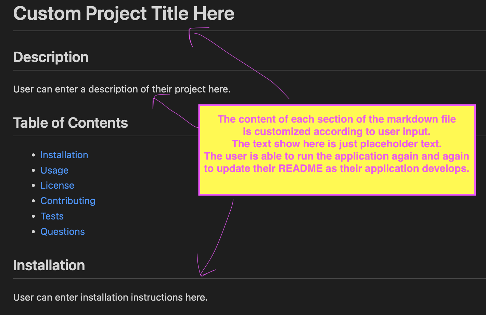

# Professional README Generator 

## Description
A command-line application that quickly and easily generates a README file from a user's input.

[Click Here](https://github.com/k8sterchi/k8s-readme-gener8r) to visit my GitHub repository.

## Table of Contents
- [Installation](#installation)
- [User Story](#user-story)
- [Acceptance Criteria](#acceptance-criteria)
- [Preview](#preview)
- [Demo](#demo)
- [Resources](#resources)
- [License](#license)

## Installation
To use this command-line application, follow these steps:
1. Make sure you have Node.js installed on your system.
2. Clone the repository or download the source code.
3. Navigate to the project directory in your terminal.
4. Run the command `npm i inquirer@8.2.4`
5. After installing the dependencies, you can invoke the application using `node index.js`

## User Story
AS A developer

I WANT a README generator

SO THAT I can quickly create a professional README for a new project.

## Acceptance Criteria
GIVEN a command-line application that accepts user input

WHEN I am prompted for information about my application repository

THEN a high-quality, professional README.md is generated with the title of my project and sections entitled Description, Table of Contents, Installation, Usage, License, Contributing, Tests, and Questions

WHEN I enter my project title

THEN this is displayed as the title of the README

WHEN I enter a description, installation instructions, usage information, contribution guidelines, and test instructions

THEN this information is added to the sections of the README entitled Description, Installation, Usage, Contributing, and Tests

WHEN I choose a license for my application from a list of options

THEN a badge for that license is added near the top of the README and a notice is added to the section of the README entitled License that explains which license the application is covered under

WHEN I enter my GitHub username

THEN this is added to the section of the README entitled Questions, with a link to my GitHub profile

WHEN I enter my email address

THEN this is added to the section of the README entitled Questions, with instructions on how to reach me with additional questions

WHEN I click on the links in the Table of Contents

THEN I am taken to the corresponding section of the README

## Preview
The image below shows the user running `node index.js` within the integrated terminal of the index.js file (highlighted in pink for emphasis):

Once user has answered all of the prompted questions, a message will appear to inform the user that their README.md has been successfully created. 

A README.md file has been generated. 

The user can run the application again and again to add additional information to their README as their project develops. 

Image below shows an example of what this application generates:

## Demo
TODO: add video link demo here

## Resources:
[The starter code was cloned from this repository.](https://github.com/coding-boot-camp/potential-enigma)

[MDN](https://developer.mozilla.org/en-US/docs/Glossary/Node.js) and my tutor last week, Dane Shrewsbury, were all very helpful in understanding how to work with node modules to create this application. 

## License:
  
[License](./LICENSE)
This application is covered under the [MIT License](./LICENSE) license.
